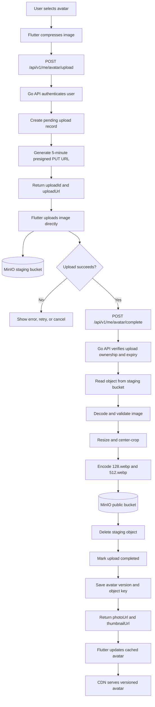

```mermaid
flowchart TD
    A[User selects avatar] --> B[Flutter compresses image]
    B --> C[POST /api/v1/me/avatar/upload]

    C --> D[Go API authenticates user]
    D --> E[Create pending upload record]
    E --> F[Generate 5-minute presigned PUT URL]
    F --> G[Return uploadId and uploadUrl]

    G --> H[Flutter uploads image directly]
    H --> I[(MinIO staging bucket)]

    H --> J{Upload succeeds?}
    J -- No --> K[Show error, retry, or cancel]
    J -- Yes --> L[POST /api/v1/me/avatar/complete]

    L --> M[Go API verifies upload ownership and expiry]
    M --> N[Read object from staging bucket]
    N --> O[Decode and validate image]
    O --> P[Resize and center-crop]
    P --> Q[Encode 128.webp and 512.webp]
    Q --> R[(MinIO public bucket)]
    R --> S[Delete staging object]
    S --> T[Mark upload completed]
    T --> U[Save avatar version and object key]
    U --> V[Return photoUrl and thumbnailUrl]

    V --> W[Flutter updates cached avatar]
    W --> X[CDN serves versioned avatar]
```